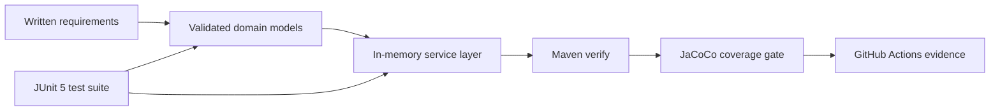

# Java Service Validation and Unit Testing

[](https://github.com/PhantomOSG-25/java-service-validation/actions/workflows/test.yml)

**Java 17 | JUnit 5 | Maven | JaCoCo | GitHub Actions**

A focused software-quality project that turns written validation requirements into testable Java behavior. The application models contacts, tasks, and appointments, then provides in-memory services for create, read, update, and delete workflows.

The portfolio version emphasizes the work employers need to evaluate: maintainable source, deterministic tests, traceable requirements, automated verification, and an honest record of defects corrected from the historical course implementation.

## What This Demonstrates

- Translating business rules into constructor and setter validation
- Designing positive, negative, boundary, and state-transition tests
- Isolating tests so results do not depend on execution order
- Injecting a fixed clock to make date-sensitive tests repeatable
- Protecting unique identifiers and rejecting duplicate records
- Preserving state when an invalid update is rejected
- Enforcing build requirements and coverage thresholds in continuous integration

## System at a Glance



| Area | Responsibilities |
| --- | --- |
| Contact | Immutable ID; validated names, ten-digit phone number, and address |
| Task | Immutable ID; validated task name and description |
| Appointment | Immutable ID; validated future-facing date and description |
| Services | Unique record storage, lookup, explicit updates, deletion, and read-only list snapshots |
| Verification | JUnit 5 tests, Maven lifecycle checks, JaCoCo coverage gates, and CI artifacts |

## Build and Verify

Requirements:

- JDK 17 or later
- Maven 3.9 or later

Run the complete quality gate:

```bash
mvn --batch-mode --no-transfer-progress clean verify
```

The `verify` phase:

1. Compiles the production and test source for Java 17.
2. Executes the JUnit 5 suite.
3. Generates the JaCoCo HTML report at `target/site/jacoco/index.html`.
4. Fails if line coverage is below 85% or branch coverage is below 75%.

GitHub Actions runs the same verification command for every pull request and every push to `main`. It retains the Surefire and JaCoCo reports for review.

## Project Structure

```text
.
|-- .github/workflows/test.yml
|-- docs/
|   |-- DEFECT_ANALYSIS.md
|   |-- REQUIREMENTS_TRACEABILITY.md
|   `-- TEST_STRATEGY.md
|-- src/
|   |-- main/java/com/michaelwood/validation/
|   |   |-- model/
|   |   `-- service/
|   `-- test/java/com/michaelwood/validation/
|       |-- model/
|       `-- service/
`-- pom.xml
```

## Test Design

The suite checks more than the normal path:

- Exact maximum-length values are accepted.
- Null, blank, oversized, incorrectly formatted, past-date, duplicate-ID, and missing-record inputs are rejected.
- All mutable fields are exercised through update operations.
- Invalid updates are checked for both the exception and unchanged stored state.
- Returned record lists are verified as structurally read-only.
- Appointment tests use a fixed `Clock`, preventing failures as calendar time advances.

See [Test Strategy](docs/TEST_STRATEGY.md) for the test-design rationale and [Requirements Traceability](docs/REQUIREMENTS_TRACEABILITY.md) for the requirement-to-test map.

## Design Decisions

- **Immutable identifiers:** IDs are assigned when a model is created and have no setter.
- **Validation close to the data:** Models enforce their own invariants, so every service path receives valid records.
- **Explicit service updates:** Services expose named update operations rather than requiring callers to mutate internal collections.
- **Deterministic ordering:** `LinkedHashMap` provides stable iteration order for review and testing.
- **Read-only snapshots:** `List.copyOf` prevents callers from structurally changing a service collection.
- **Deterministic time:** The appointment model accepts a `Clock` for repeatable tests while retaining a convenient production constructor.

## Historical Improvement

This maintained version is based on the contacts, tasks, and appointments requirements from CS 320 Software Test Automation. The original Eclipse submission contained defects such as unassigned constructor fields, reference-based string comparisons, time-sensitive dates, contradictory assertions, and order-dependent identifiers.

Those problems were treated as a debugging and QA exercise. The professional version corrects the behavior, uses a standard Maven layout, and adds repeatable automated verification. See [Defect Analysis](docs/DEFECT_ANALYSIS.md) for the concise before-and-after record.

Raw course archives, desktop screenshots, journals, reports, grades, and institutional-system details are intentionally excluded from the professional project tree.

## Scope and Limitations

This is an in-memory validation and unit-testing project, not a production customer-management system.

- Data is not persisted between runs.
- There is no user interface, network API, authentication, or authorization.
- The services are not designed for concurrent access.
- Sample names, phone numbers, addresses, dates, and identifiers are fictitious test fixtures.

These boundaries keep the repository focused on validation, service behavior, defect prevention, and automated testing.

## Author

Michael B. Wood  
Bachelor of Science in Computer Science, Software Engineering concentration  
Southern New Hampshire University, August 2026
